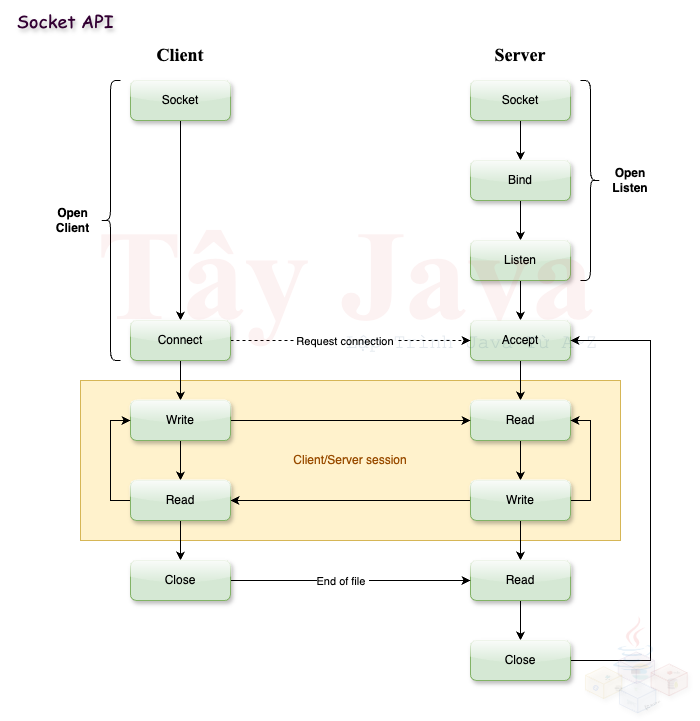

# Java Networking
Java Networking là một phần quan trọng trong lập trình Java, giúp các ứng dụng Java giao tiếp với nhau thông qua network. Java cung cấp các packages và API để hỗ trợ việc xây dựng các ứng dụng mạng như client-server, peer-to-peer hay phân tán. Dưới đây là một số khái niệm và thành phần quan trọng của Java Networking.

### 1. Gói java.net
Gói `java.net` chứa các class và interface cung cấp các chức năng network trong Java. Nó bao gồm một số lớp chính như:
- InetAddress: Đại diện cho một địa chỉ IP.
- URL: Đại diện cho một URL (Uniform Resource Locator) và cho phép truy xuất dữ liệu từ các tài nguyên qua mạng.
- URLConnection: Kết nối với tài nguyên được chỉ định bởi URL.
- Socket: Được sử dụng cho kết nối TCP.
- ServerSocket: Được sử dụng để tạo một server và chờ kết nối từ các client (TCP).
- DatagramSocket và DatagramPacket: Được sử dụng cho kết nối UDP, giúp gửi và nhận các packet không yêu cầu kết nối.

### 2. Giao thức mạng
- TCP (Transmission Control Protocol): Giao thức hướng kết nối, đảm bảo dữ liệu được truyền an toàn, chính xác và theo đúng thứ tự.
- UDP (User Datagram Protocol): Giao thức không kết nối, nhanh hơn TCP nhưng không đảm bảo toàn vẹn dữ liệu như truyền không đúng thứ tự hay không mất mát.

### 3. Lập trình Socket trong Java
#### 3.1 TCP Sockets:
TCP là giao thức phổ biến trong mạng client-server.



- **Server**: 
Tạo một đối tượng ServerSocket lắng nghe kết nối trên một cổng cụ thể, Khi có kết nối từ client, server sẽ tạo ra một Socket để giao tiếp với client.
```java
import java.io.*;
import java.net.*;

public class SampleServer {
    public static void main(String[] args) throws IOException {
        ServerSocket serverSocket = new ServerSocket(4953);  // Mở cổng 4953
        System.out.println("Server đang chờ kết nối...");

        Socket socket = serverSocket.accept();  // Chờ client kết nối
        System.out.println("Client đã kết nối.");

        // Nhận dữ liệu từ client
        InputStream input = socket.getInputStream();
        BufferedReader reader = new BufferedReader(new InputStreamReader(input));
        String message = reader.readLine();
        System.out.println("Message từ client: " + message);

        // Gửi phản hồi đến client
        OutputStream output = socket.getOutputStream();
        PrintWriter writer = new PrintWriter(output, true);
        writer.println("Xin chào từ Server!");

        socket.close();
        serverSocket.close();
    }
}
```

- **Client**: Tạo một đối tượng Socket để kết nối với server
```java
import java.io.*;
import java.net.*;

public class SampleClient {
    public static void main(String[] args) throws IOException {
        Socket socket = new Socket("localhost", 4953);  // Kết nối đến server ở cổng 1234

        // Gửi dữ liệu đến server
        OutputStream output = socket.getOutputStream();
        PrintWriter writer = new PrintWriter(output, true);
        writer.println("Xin chào từ Client!");

        // Nhận phản hồi từ server
        InputStream input = socket.getInputStream();
        BufferedReader reader = new BufferedReader(new InputStreamReader(input));
        String response = reader.readLine();
        System.out.println("Phản hồi từ server: " + response);

        socket.close();
    }
}
```

#### 3.2 UDP Sockets:
UDP không yêu cầu kết nối trước khi gửi dữ liệu, các gói tin được gửi độc lập với nhau.

- **Server UDP**: Sử dụng `DatagramSocket` để nhận các gói tin từ client.
```java
import java.net.*;

public class SampleUDPServer {
    public static void main(String[] args) throws IOException {
        DatagramSocket socket = new DatagramSocket(7749);
        byte[] receiveData = new byte[1024];
        System.out.println("Server UDP đang chờ nhận dữ liệu...");

        DatagramPacket receivePacket = new DatagramPacket(receiveData, receiveData.length);
        socket.receive(receivePacket);
        String message = new String(receivePacket.getData());
        System.out.println("Nhận từ client: " + message.trim());

    }
}

```

- **Client UDP**: Sử dụng `DatagramSocket` và `DatagramPacket` để gửi dữ liệu.
```java
public class SampleUDPClient {
    public static void main(String[] args) throws Exception {
        DatagramSocket socket = new DatagramSocket();
        byte[] sendData = "Xin chào Tây Java".getBytes();

        InetAddress IPAddress = InetAddress.getByName("localhost");
        DatagramPacket sendPacket = new DatagramPacket(sendData, sendData.length, IPAddress, 7749);
        socket.send(sendPacket);

        socket.close();
    }
}
```

### 4. Giao tiếp URL
Java cung cấp cách để giao tiếp với các tài nguyên qua URL bằng các lớp `URL` và `URLConnection`.

```java
import java.net.*;
import java.io.*;

public class URLReader {
    public static void main(String[] args) throws Exception {
        URL url = new URL("http://tayjava.vn");
        BufferedReader in = new BufferedReader(new InputStreamReader(url.openStream()));

        String inputLine;
        while ((inputLine = in.readLine()) != null)
            System.out.println(inputLine);
        in.close();
    }
}
```

### 5. Lợi ích và ứng dụng của Java Networking
Java Networking rất hữu ích trong các ứng dụng hiện đại như web services, các hệ thống phân tán hoặc bất kỳ ứng dụng nào cần giao tiếp qua mạng.

- **Tính độc lập nền tảng**: Java hỗ trợ đa nền tảng nên các ứng dụng mạng có thể chạy trên bất kỳ hệ điều hành nào hỗ trợ Java.
- **Hỗ trợ giao thức chuẩn**: Java cung cấp hỗ trợ mạnh mẽ cho các giao thức mạng chuẩn như HTTP, FTP, TCP, và UDP.
- **Tính bảo mật**: Java cung cấp các công cụ mạnh mẽ để bảo vệ kết nối mạng, bao gồm SSL/TLS và các API cho phép mã hóa và xác thực.
---

## Câu hỏi phỏng vấn
### I. Câu hỏi cơ bản
#### 1. Java Networking là gì?
> Có thể giải thích khái niệm Java Networking và các thành phần chính của nó?

#### 2. Phân biệt TCP và UDP trong Java Networking
> Hãy giải thích sự khác biệt giữa TCP (Transmission Control Protocol) và UDP (User Datagram Protocol).

#### 3. Lớp InetAddress trong Java dùng để làm gì ?
> Hãy giải thích chức năng của lớp InetAddress và cách nó được sử dụng trong Java Networking.

#### 4. Bạn sẽ làm gì để tạo một kết nối TCP giữa server và client trong Java ?
> Hãy mô tả cách sử dụng ServerSocket và Socket để thiết lập một kết nối TCP giữa server và client.

#### 5. Làm thế nào để gửi và nhận dữ liệu qua kết nối TCP trong Java ?
> Hãy giải thích cách sử dụng InputStream và OutputStream để gửi và nhận dữ liệu qua một kết nối TCP.

### II. Câu hỏi nâng cao
#### 1. Giải thích sự khác nhau giữa Socket và ServerSocket ?
> Hãy so sánh giữa Socket và ServerSocket trong Java và chức năng của từng lớp.

#### 2. Lớp DatagramSocket và DatagramPacket được sử dụng như thế nào trong UDP ?
> Hãy giải thích cách sử dụng DatagramSocket và DatagramPacket để gửi và nhận dữ liệu trong giao thức UDP.

#### 3. Cách xử lý nhiều client kết nối tới server trong Java Networking
> Hãy giải thích cách xử lý nhiều client kết nối tới một server, đặc biệt là cách sử dụng đa luồng (multithreading).

#### 4. Làm thế nào để đọc dữ liệu từ một URL trong Java ?
> Hãy mô tả cách sử dụng lớp URL và URLConnection để truy xuất dữ liệu từ một URL.

#### 5. Sự khác biệt giữa InputStreamReader và BufferedReader trong việc đọc dữ liệu từ mạng là gì ?
> Hãy giải thích sự khác nhau và khi nào nên sử dụng InputStreamReader và BufferedReader trong lập trình mạng.

### III. Câu hỏi tình huống
#### 1. Bạn sẽ làm gì nếu server nhận được yêu cầu từ một client nhưng không gửi phản hồi ?
> Đưa ra các bước xử lý trong trường hợp server không phản hồi client và cách gỡ lỗi vấn đề.

#### 2. Làm thế nào để bảo mật các kết nối mạng trong Java ?
> Hãy mô tả cách sử dụng các kỹ thuật như SSL/TLS trong Java để bảo mật các kết nối mạng.

#### 3. Bạn sẽ làm gì để kiểm tra sự ổn định của một kết nối mạng giữa client và server trong Java ?
> Mô tả cách kiểm tra và quản lý sự ổn định của kết nối, bao gồm kiểm soát timeout và retry.

#### 4. Bạn có thể tối ưu hóa hiệu suất của một ứng dụng mạng Java như thế nào ?
> Đưa ra các cách để tối ưu hóa hiệu suất mạng trong ứng dụng Java, ví dụ như sử dụng kỹ thuật nén dữ liệu, tối ưu hóa buffer size, hoặc dùng NIO (Java Non-blocking I/O).

#### 5. Hãy giải thích kiến trúc của một ứng dụng client-server bạn đã xây dựng
> Cung cấp ví dụ về một ứng dụng mạng bạn đã xây dựng và giải thích chi tiết về kiến trúc của nó, cách xử lý kết nối và trao đổi dữ liệu.
