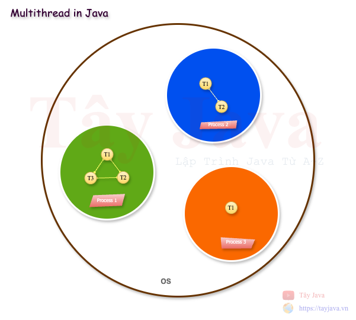

# Multithreading in Java

Multithreading trong Java là một kỹ thuật cho phép thực hiện đồng thời nhiều đoạn mã code hay nhiều luồng (thread) trong một ứng dụng nhằm tăng hiệu suất và tận dụng tối đa tài nguyên của hệ thống. `Multithreading` rất hữu ích trong các ứng dụng cần xử lý nhiều tác vụ cùng lúc, ví dụ như trong xử lý song song, ứng dụng web hoặc trò chơi.

### 1. Thread trong Java là gì?
Trong Java, `thread` là một đơn vị nhỏ nhất của một tiến trình (process), có thể chạy đồng thời với các thread khác trong cùng một tiến trình. Mỗi thread chia sẻ cùng không gian bộ nhớ của tiến trình cha, nhưng có thể thực hiện các tác vụ khác nhau.



Có 2 cách tạo và quản lý thread
    - Kế thừa từ lớp Thread.
    - Triển khai giao diện Runnable.

### 2. Tạo thread bằng cách kế thừa lớp `Thread`
Khi kế thừa từ lớp Thread, bạn cần override phương thức `run()` để định nghĩa công việc mà `thread` sẽ thực hiện

```java
class TestThread extends Thread {
    @Override
    public void run() {
        for (int i = 0; i < 5; i++) {
            System.out.println("TestThread is running: " + i);
        }
    }
}

public class Main {
    public static void main(String[] args) {
        TestThread thread1 = new TestThread();
        TestThread thread2 = new TestThread();

        thread1.start();
        thread2.start();
    }
}
```

### 3. Tạo thread bằng cách `implements` Runnable Interface

Cách tiếp cận phổ biến hơn là `implements` Runnable Interface. Lý do là vì Java không hỗ trợ đa kế thừa các class kế thừa từ `Thread` nên việc sử dụng `Runnable` cho phép một class kế thừa các `class` khác mà vẫn có thể sử dụng đa luồng.

```java
class TestRunnable implements Runnable {
    @Override
    public void run() {
        for (int i = 0; i < 5; i++) {
            System.out.println("TestRunnable thread is running: " + i);
        }
    }
}

public class Main {
    public static void main(String[] args) {
        TestRunnable testRunnable = new TestRunnable();
        Thread thread = new Thread(testRunnable);

        thread.start();
    }
}
```

### 4. Sự khác biệt giữa Thread và Runnable
- Extends Thread: Khi một `class extends Thread` thì `class` đó không thể kế thừa từ một `class` nào khác
- Implements Runnable: Khi sử dụng Runnable, bạn có thể linh hoạt hơn trong việc thiết kế class, vì bạn có thể kế thừa từ các class khác.

### 5. Các phương thức quản lý thread
- **start()**: Bắt đầu thread và chuyển nó vào trạng thái "runnable".
- **run()**: Định nghĩa công việc của thread (không gọi trực tiếp phương thức này để bắt đầu thread, chỉ start() mới thực sự bắt đầu thread).
- **sleep(milliseconds)**: Tạm ngừng thread hiện tại trong một khoảng thời gian.
- **join()**: Chờ cho một thread kết thúc trước khi tiếp tục các công việc khác.
- **yield()**: Tạm nhường CPU cho các thread khác có cùng độ ưu tiên.
- **setPriority(int priority)**: Đặt mức độ ưu tiên cho thread (1-10).
- **isAlive()**: Kiểm tra xem một thread có còn đang chạy hay không.

### 6. Thread Synchronization (Đồng bộ hóa thread)

Trong môi trường `multithreading`, nếu nhiều thread cùng truy cập vào một tài nguyên chung có thể xảy ra các vấn đề về đồng bộ (race condition). Để tránh điều này chúng ta có thể sử dụng từ khóa `synchronized` để đảm bảo rằng chỉ một `thread` có thể truy cập tài nguyên đó tại một thời điểm.
```java
public class Counter {
    private int count = 0;

    // Đồng bộ hóa phương thức
    public synchronized void increment() {
        count++;
    }

    public int getCount() {
        return count;
    }
}

public class Main {

    public static void main(String[] args) throws InterruptedException {
        Counter counter = new Counter();

        // Tạo hai thread cùng tăng giá trị của counter
        Thread thread5 = new Thread(() -> {
            for (int i = 0; i < 1000; i++) {
                counter.increment();
                System.out.println("thread5: " + counter.getCount());
            }
        });

        Thread thread6 = new Thread(() -> {
            for (int i = 0; i < 1000; i++) {
                counter.increment();
                System.out.println("thread6: " + counter.getCount());
            }
        });

        thread5.start();
        thread6.start();

        // Đợi cả hai thread hoàn thành
        thread5.join();
        thread6.join();

        // Kết quả chính xác do có đồng bộ hóa
        System.out.println("Final count: " + counter.getCount());
    }
}
```

### 7. ExecutorService và Thread Pool

Khi cần quản lý nhiều `thread`,chúng ta nên sử dụng `ExecutorService` để tối ưu hóa việc tạo và quản lý `thread`. `ExecutorService` sử dụng các `Thread Pool` để tái sử dụng thread, giúp cải thiện hiệu suất và tiết kiệm tài nguyên hệ thống.
```java
public class Main {
    public static void main(String[] args) {
        // Tạo một Thread Pool với 3 thread
        ExecutorService executor = Executors.newFixedThreadPool(3);

        // Thực thi các tác vụ
        for (int i = 0; i < 5; i++) {
            executor.submit(() -> {
                System.out.println("Thread " + Thread.currentThread().getName() + " is running.");
            });
        }

        // Đóng ExecutorService
        executor.shutdown();
    }
}
```

### 8. Deadlock và Livelock
- **Deadlock**: Xảy ra khi hai hoặc nhiều `thread` chờ lẫn nhau để giải phóng tài nguyên mà mỗi `thread` khác đang giữ, dẫn đến việc không `thread` nào có thể tiến hành công việc của mình.
- **Livelock**: Xảy ra khi hai `thread` hoặc nhiều hơn phản ứng với nhau và tiếp tục thay đổi trạng thái của mình nhưng không thực sự tiến triển. Để tránh tình trạng này, bạn có thể sử dụng các kỹ thuật đồng bộ cẩn thận hoặc sử dụng các cấu trúc khóa không chặn (non-blocking).

---
### Câu hỏi phỏng vấn


