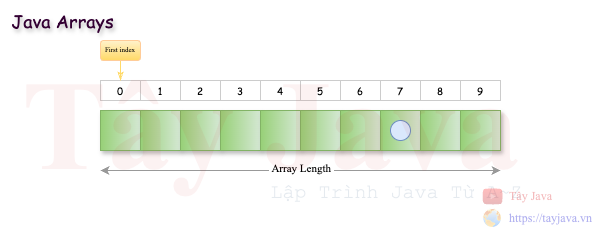
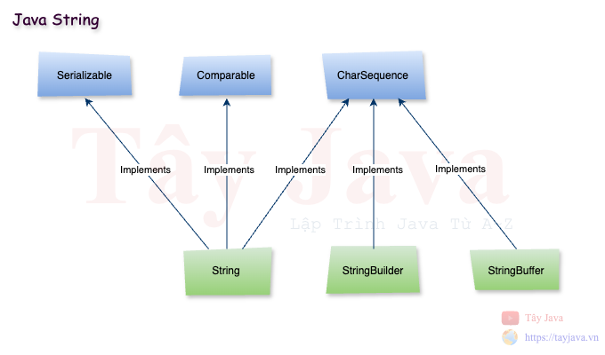
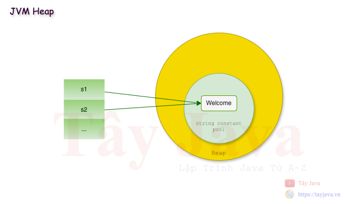

# Java Arrays và Java String

### 1. Java Arrays

#### 1.1 Giới thiệu về Java Arrays
Mảng Java là một đối tượng chứa các phần tử có cùng kiểu dữ liệu. Các phần tử của một mảng được lưu trữ trong một vị trí bộ nhớ liền kề. Đây là một cấu trúc dữ liệu để lưu trữ các phần tử giống nhau. Chúng ta chỉ có thể lưu trữ một tập hợp các phần tử cố định trong một mảng Java.

Chúng ta có thể lưu các giá trị nguyên thuỷ hoặc các đối tượng trong array và tất cả các phâng tử đều được đánh chỉ mục.



- Ưu điểm:
  - Tối ưu code: Nó làm cho code được tối ưu hoá vì chung ta dễ dàng sắp xếp và truy xuất dữ liệu.
  - Truy xuất ngẫu nhiên: Chúng ta có thể lấy bất kỳ dữ liệu nào theo chỉ mục.

- Nhược điểm:
  - Giới hạn kích thước: Chúng ta chỉ có thể lưu trữ kích thước cố định của các phần tử trong mảng. Nó không tăng kích thước khi chạy chương trình. Để giải quyết vấn đề này Java collection có thể tự động gia tăng kích thước của array.

#### 1.2 Các loại Arrays__

Có 2 loại array:
- Mảng một chiều (Single Dimensional Array)
- Mảng đa chiều (Multidimensional Array)

##### 1.2.1 Mảng một chiều (Single Dimensional Array)
- Cú pháp
  ```java
  // Định nghĩa array
  dataType[] arr; (or)  
  dataType []arr; (or)  
  dataType arr[];

  // Khởi tạo
  arrayRefVa r= new datatype[size];  
  ```
  
- Ví dụ
  ```java
  public static void main(String[] args) {

    int arr[] = new int[3];// định nghĩa và tạo array
  
    arr[0] = 13; // gán phần từ vào mảng
    arr[1] = 49;
    arr[2] = 77;
  
    // Duyệt mảng
    for (int i = 0; i < arr.length; i++) {
      System.out.println(arr[i]);
    }
  
    // Mảng string
    String arrS[] = {"A", "B", "C", "D"};
    for (String s: arrS) {
        System.out.println(s);
    }
  }
  ```
- Test
  ```text
  13
  49
  77
  ---
  A
  B
  C
  D
  ```

- Định nghĩa, khai báo và khởi tạo array
    ```java
    public static void main(String[] args) {
        //declaration, instantiation and initialization
        int xArr[] = {1, 3, 7};
    
        // in mảng bằng foreach
        for (int i : xArr) {
            System.out.println(i);
        }
    }
    ```

- Test
  ```text
  1
  3
  7
  ```

- ArrayIndexOutOfBoundsException
  > Ngoại lệ `ArrayIndexOutOfBoundsException` xảy ra khi chúng ta cố gắng truy xuất phần tử ngoài độ dài của mảng.
  
  - Ví dụ
    
  ```java
  public static void main(String[] args) {
  
    int yArr[] = {2,4,6};
    System.out.println("Độ dài của yArr = " + yArr.length);
    System.out.println(yArr[0]);
    System.out.println(yArr[1]);
    System.out.println(yArr[2]);
    // dòng này bị lỗi ArrayIndexOutOfBoundsException do mảng chỉ có 3 phần tử và index = 3 là không tồn tại.
    System.out.println(yArr[3]);
  }
  ```
    
    - Test
    ```java
    Độ dài của yArr = 3
    2
    4
    6
    Exception in thread "main" java.lang.ArrayIndexOutOfBoundsException: Index 3 out of bounds for length 3
    at src.Main.main(Main.java:32)
    ```

##### 1.2.2 Mảng đa chiều (Multidimensional Array)

- Cú pháp
```java
dataType[][] arr; (or)  
dataType [][]arr; (or)  
dataType arr[][]; (or)  
dataType []arr[];  
```

- Ví dụ
```java
int[][] xArr = new int[3][3]; // 3 = row and 3 = column

xArr[0][0] = 1;
xArr[0][1] = 2;
xArr[0][2] = 3;

xArr[1][0] = 4;
xArr[1][1] = 5;
xArr[1][2] = 6;

xArr[2][0] = 7;
xArr[2][1] = 8;
xArr[2][2] = 9;

System.out.println("--- xArr ---");
for (int i = 0; i < 3; i++) {
  for (int j = 0; j < 3; j++) {
    System.out.println(xArr[i][j]);
  }
  System.out.println();
}

int[][] yArr = {{10, 20, 30}, {40, 50, 60}, {70, 80, 90}};
System.out.println("--- yArr ---");
for (int i = 0; i < 3; i++) {
  for (int j = 0; j < 3; j++) {
    System.out.println(yArr[i][j]);
  }
    System.out.println();
}
```

Output
```text
--- xArr ---
1
2
3

4
5
6

7
8
9

--- yArr ---
10
20
30

40
50
60

70
80
90
```

##### 1.2.3 Jagged Array (Mảng răng cưa)

```java
public static void main(String[] args) {
// Mảng 2 chiều
    int arr[][] = new int[3][];
    arr[0] = new int[3];
    arr[1] = new int[5];
    arr[2] = new int[2];

// Tạo mảng răng cưa
    int count = 0;
    for (int i = 0; i < arr.length; i++)
        for (int j = 0; j < arr[i].length; j++)
            arr[i][j] = count++;

// printing the data of a jagged array
    for (int i = 0; i < arr.length; i++) {
        for (int j = 0; j < arr[i].length; j++) {
            System.out.print(arr[i][j] + " ");
        }
        System.out.println();//new line
    }
}
```

Output
```text
0 1 2 
3 4 5 6 7 
8 9 
```


- Clone Array
```java
public static void main(String[] args) {
    
    System.out.println("--- zArr ---");
    int[] zArr = yArr[0].clone(); // Clone array
    for (int i : zArr) {
        System.out.println(i);
    }
}
```
Test
```text
--- zArr ---
10
20
30
```

- Copy Array

Cú pháp
```java
public static void arraycopy(
  Object src, int srcPos,Object dest, int destPos, int length  
) 
```

Ví dụ
```java
public static void main(String[] args) {
    char[] fromArr = {'T', 'a', 'y', 'J', 'a', 'v', 'a'};
    char[] toArr = new char[4];

    // copy Java từ fromArr tới toArr
    System.arraycopy(fromArr, 3, toArr, 0, 4);

    System.out.println(String.copyValueOf(toArr));
}
```

### 2. Java String

#### 2.1 Giới thiệu về Java String

Trong Java, String về cơ bản là một đối tượng biểu diễn chuỗi các giá trị char. Một mảng các ký tự hoạt động giống như Java string

```java
char[] ch = {'T', 'a', 'y', 'J', 'a', 'v', 'a'};
String s = new String(ch);
```
>>
```java
String s = "TayJava";
```

Lớp Java String cung cấp nhiều phương thức để thực hiện các để xử lý String như compare(), concat(), equals(), split(), length(), replace(), compareTo(), intern(), substring(), v.v.

Interface CharSequence được sử dụng để biểu diễn chuỗi ký tự. Các lớp String, StringBuffer và StringBuilder đều `implements` nó. Điều đó có nghĩa là chúng ta có thể tạo một `string` trong Java bằng cách sử dụng ba lớp này.



Java String là bất biến, nghĩa là không thể thay đổi kích thước của nó. Bất cứ khi nào chúng ta thay đổi bất kỳ `string` nào đó thì một `instance` mới sẽ được tạo ra. Nếu bạn muốn sử dụng các chuỗi có thể thay đổi thì có thể dùng StringBuffer và StringBuilder.


#### 2.2 Làm thế nào để khởi tạo một Java String ?

##### 2.2.1 Bằng string literal
String được tạo ra với dấu `""` 

```java
String s1 = "Welcome to Tay Java";
```

Mỗi lần bạn tạo ra một String, JVM sẽ kiểm tra "string constant pool" trước. Nếu String đã tồn tại trong pool thì một tham chiếu đến instance đó sẽ được tạo ra. Nều String đó chưa tồn tại thì JVM sẽ tạo string mới.

```java
String s1 = "Welcome to Tay Java";
String s2 = "Welcome to Tay Java"; // JVM không tạo một string mới
```



Tại sao Java sử dụng khái niệm String literal?

> Để làm cho Java sử dụng bộ nhớ hiệu quả hơn bởi vì không có đối tượng mới nào được tạo nếu nó đã tồn tại trong Spring constant pool.

##### 2.2.2 Bằng từ khoá new

```java
String s1 = new String("Welcome to Tay Java");
```

Trong trường hợp như vậy, JVM sẽ tạo một đối tượng String mới trong bộ nhớ heap bình thường (không phải pool) và giá trị "Welcome" theo nghĩa đen sẽ được đặt trong __Spring constant pool__. Biến s sẽ tham chiếu đến đối tượng trong heap (không phải pool).

##### 2.2.3 Các method trong class String
| #  | Method                                              | Mô tả                                      |
|----|-----------------------------------------------------|--------------------------------------------|
| 1  | char charAt(int index)                              | Trả về giá trị char cho index cụ thể       |
| 2  | int length()                                        | Trả về độ dài của String                   |
| 3  | static String format(String format, Object... args) | Trả về một String đã được định dạng        |
| 4  | String substring(int beginIndex)                    | Trả về substring từ vị trí index cho trước |
| 5  | String substring(int beginIndex, int endIndex)                                                    |                                            |
| 6  |                                                     |                                            |
| 7  |                                                     |                                            |
| 8  |                                                     |                                            |
| 9  |                                                     |                                            |
| 10 |                                                     |                                            |
| 11 |                                                     |                                            |
| 12 |                                                     |                                            |
| 13 |                                                     |                                            |
| 14 |                                                     |                                            |
| 15 |                                                     |                                            |
| 16 |                                                     |                                            |
| 17 |                                                     |                                            |
| 18 |                                                     |                                            |
| 19 |                                                     |                                            |
| 20 |                                                     |                                            |
| 21 |                                                     |                                            |
| 22 |                                                     |                                            |
| 23 |                                                     |                                            |
| 24 |                                                     |                                            |
| 25 |                                                     |                                            |
| 26 |                                                     |                                            |
| 27 |                                                     |                                            |
| 28 |                                                     |                                            |


  


