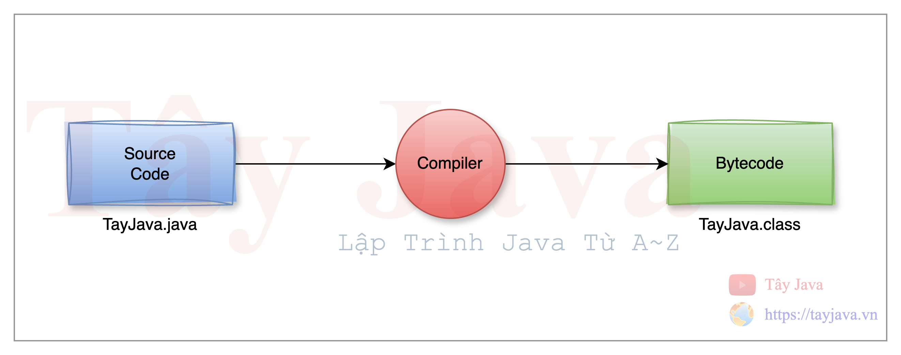
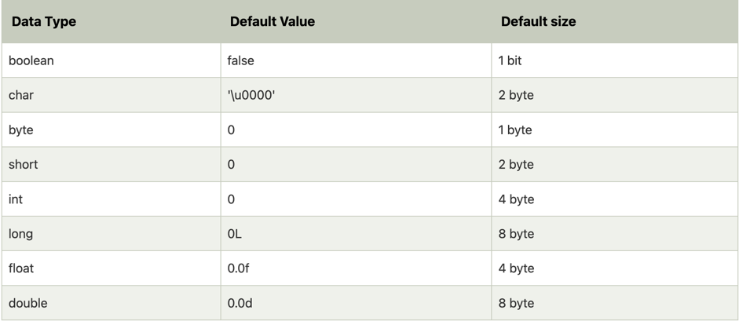
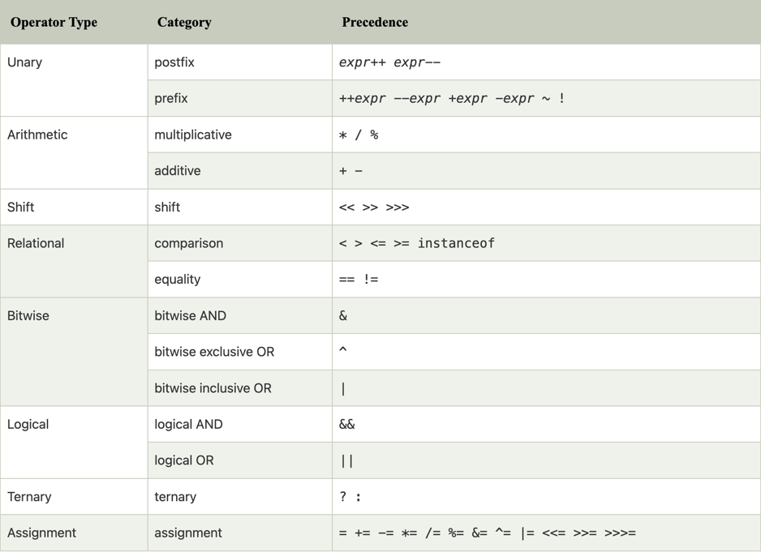

# Nhập Môn Java

### 1. Java là gì ?
Java là một ngôn ngữ lập trình hướng đối tượng, được James Gosling tại Sun Microsystems giới thiệu lần đầu tiên năm 1992 như là một ngôn ngữ dùng trong nội bộ tập đoàn Sun Microsystems để xây dựng ứng dụng điều khiển các bộ xử lý bên trong máy điện thoại cầm tay, lò vi sóng, các thiết bị điện tử dân dụng khác. Không chỉ là một ngôn ngữ, Java còn là một nền tảng phát triển và triển khai ứng dụng trong đó máy ảo Java, bộ thông dịch có vai trò trung tâm.
Sau đó Oracle mua Sun Microsystems rồi phát triển thành Java platform tới ngày nay. Sun Microsystems chính thức ban hành bản Java Development Kit 1.0 vào năm 1996 hoàn toàn miễn phí để các nhà phát triển có thể tải về, học Java, xây dựng các ứng dụng Java và triển khai chúng trên các hệ điều hành có hỗ trợ Java. Đến này bản JDK mới nhất là JDK 23.
___Nguồn tham khảo___
- [Java (ngôn ngữ lập trình)](https://vi.wikipedia.org/wiki/Java_(ng%C3%B4n_ng%E1%BB%AF_l%E1%BA%ADp_tr%C3%ACnh))
- [Java (công nghệ)](https://vi.wikipedia.org/wiki/Java_(c%C3%B4ng_ngh%E1%BB%87))
### 2. Đặc điểm nổi bật của Java
Java là một ngôn ngữ lâpj trình hướng đối tượng có cú pháp tương đối giống ngôn ngữ lập trình C, C++ nhưng nó chứa ít cơ sở cấp thấp(ngôn ngữ cấp thấp là ngôn ngữ liên quan chặt chẽ đến phần cứng máy tính)
Java được phát triển với mục đích chung là chạy được trên tất cả các nền tảng hỗ trợ Java mà không cần biên dịch lại. Các ứng dụng Java thường được biên dịch thành bytecode có thể chạy trên bất kỳ máy ảo Java (JVM) nào bất kể kiến trúc máy tính bên dưới.
Java runtime cung cấp các khả năng động thường không có sẵn trong các ngôn ngữ biên dịch truyền thống. Tính đến năm 2019 Java là một trong những ngôn ngữ lập trình phổ biến nhất được sử dụng theo GitHub.
Java có 3 đặc trưng nổi bật là Java compiler, JVM và các Library
Phần mềm Java chạy trên mọi thứ, từ máy tính xách tay đến trung tâm dữ liệu, bảng điều khiển trò chơi đến siêu máy tính khoa học.

### 3. JDK, JRE, JVM là gì ?
> Có 5 mục tiêu chính trong việc xây dựng ngôn ngữ Java

- Nó phải đơn giản, hướng đối tượng và quen thuộc.
- Nó phải mạnh mẽ và an toàn.
- Nó phải không phụ thuộc vào kiến trúc và có tính di động.
- Nó phải thực thi với hiệu suất cao.
- Nó phải được thông dịch, phân luồng và động.

> Một mục tiêu thiết kế của Java là tính di động, có nghĩa là các chương trình được viết cho nền tảng Java phải chạy tương tự nhau trên bất kỳ sự kết hợp nào giữa phần cứng và hệ điều hành với hỗ trợ thời gian chạy thích hợp. Điều này đạt được bằng cách biên dịch mã ngôn ngữ Java sang một đại diện trung gian được gọi là Java bytecode, thay vì trực tiếp tới mã máy cụ thể về kiến trúc. Các lệnh mã bytecode trong Java tương tự như mã máy, nhưng chúng được thiết kế để thực thi bởi một máy ảo (VM) được viết riêng cho phần cứng máy chủ. Như vậy JVM (Java Virtual Machine) là một máy ảo để chạy chương trình Java ở dạng bytecode. 

> Người dùng cuối thường sử dụng Java Runtime Environment (JRE) được cài đặt trên máy của họ cho các ứng dụng Java độc lập hoặc trong trình duyệt web cho các ứng dụng Java.

> Java Development Kit (JDK) là một tập hợp những công cụ phần mềm được phát triển bởi Sun Microsystems dành cho các nhà phát triển phần mềm, dùng để viết những applet Java hay những ứng dụng Java. Bộ công cụ này được phát hành miễn phí gồm có trình biên dịch, trình thông dịch, trình giúp sửa lỗi (debugger) trình chạy applet và tài liệu nghiên cứu.


### 4. Thiết lập môi trường Java
- Cài đặt JDK theo [Hướng dẫn tại cài đặt JDK](https://tayjava.vn/cai-dat-jdk-tren-macos-window-linux-ubuntu)
- Cài đặt IntelliJ theo [Hưỡng dẫn cài đặt IntelliJ](https://tayjava.vn/cai-dat-intellij-tren-macos-va-window)

### 5. Tạo chương trình java đầu tiên
- Tạo chương trinhg Java đầu tiên như sau:
```java
public class TayJava {

    public static void main(String[] args) {
        System.out.println("Welcome to Tây Java");
    }
}
```
- Từ khóa `class` được sử dụng để khai báo một lớp trong Java.
- Từ khóa `public` là một trình sửa đổi truy cập biểu thị khả năng hiển thị. Nghĩa là nó hiển thị với tất cả mọi người.
- `static` là một từ khóa. Nếu chúng ta khai báo bất kỳ phương thức nào là static, thì nó được gọi là phương thức static. Ưu điểm cốt lõi của phương thức static là không cần tạo đối tượng để gọi phương thức static. Phương thức main() được JVM thực thi, vì vậy không yêu cầu tạo đối tượng để gọi phương thức main(). Vì vậy, nó tiết kiệm bộ nhớ.
- `void` là kiểu trả về của phương thức. Nghĩa là nó không trả về bất kỳ giá trị nào.
- `main` biểu thị điểm bắt đầu của chương trình.
- `String[] args` hoặc `String args[]` được sử dụng làm đối số dòng lệnh.
- `System.out.println()` được sử dụng để in câu lệnh. Ở đây, `System` là một lớp, out là một đối tượng của lớp `PrintStream`, `println()` là một phương thức của lớp `PrintStream`.


- Chạy câu lệnh sau để biên dịch `TayJava.java`. Sau khi biên dịch chúng ta sẽ có 1 file `TayJava.class`
```bash
$   javac TayJava.java
```

- Chạy chương trình Java đầu tiên với lệnh sau:
```bash
$ java TayJava
```
 Quy trình biên dịch như sau: `Source code -> Compiler -> Bytecode`




### 6. Các loại biến trong Java
Có 3 loại variable trong Java
- __Local variable:__ Một biến được khai báo bên trong thân phương thức(method) được gọi là local variable. Bạn chỉ có thể sử dụng biến này trong phương thức đó và các phương thức khác trong lớp thậm chí không biết rằng biến này tồn tại.

- __Instance variable:__ Một biến được khai báo bên trong `class` nhưng bên ngoài phương thức được gọi là `instance variable`. Biến này không được khai báo là `static`. Biến này được gọi là `instance variable` vì giá trị của biến này là cụ thể cho từng `instance` cụ thể và không được chia sẻ giữa các `instance`.

- __Static variable:__ Một biến được khai báo là `static` được gọi là `static variable`. Biến này không thể là `local variable`. Bạn có thể tạo một bản sao duy nhất của `static variable` và chia sẻ biến này giữa tất cả các `method` của `clas`. Việc cấp phát bộ nhớ cho các biến tĩnh chỉ diễn ra một lần khi lớp được tải trong bộ nhớ.

- Ví dụ:
```java
public class TayJava {

    static String name = "Tây Java";


    public static void main(String[] args) {

        String sayHello = "Welcome to"; // instance variable

        System.out.println(sayHello + " " + name);
    }

    void greeting() {
        String hello = "Hi, This is my first application"; // local variable
    }
}

```


### 7. Các kiểu dữ liệu trong Java




### 8. Các loại toán tử trong Java


### 9. Các loại từ khoá cần ghi nhớ trong Java
- Từ khóa `static` trong Java chủ yếu được sử dụng để quản lý bộ nhớ. Chúng ta có thể áp dụng từ khóa `static` với các biến, phương thức, khối và lớp lồng nhau. Từ khóa static thuộc về lớp hơn là một thể hiện của lớp.
- Có thể sử dụng rất nhiều từ khóa `this` trong Java. Trong Java, this là biến tham chiếu tham chiếu đến đối tượng hiện tại.
