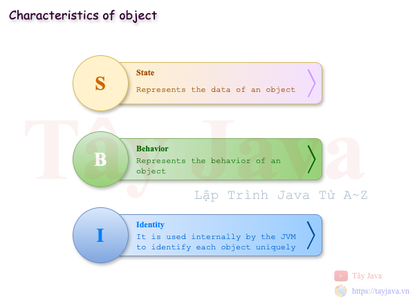
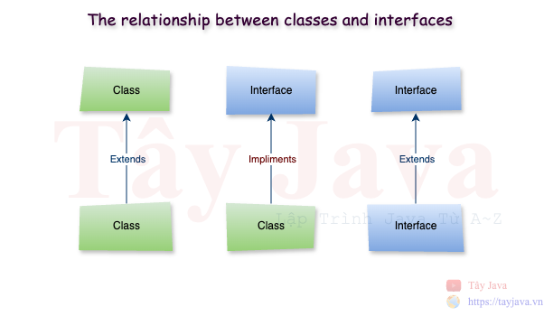
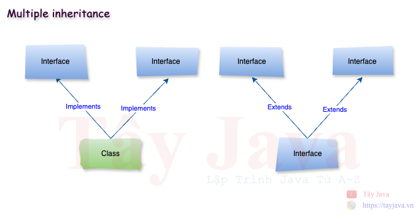
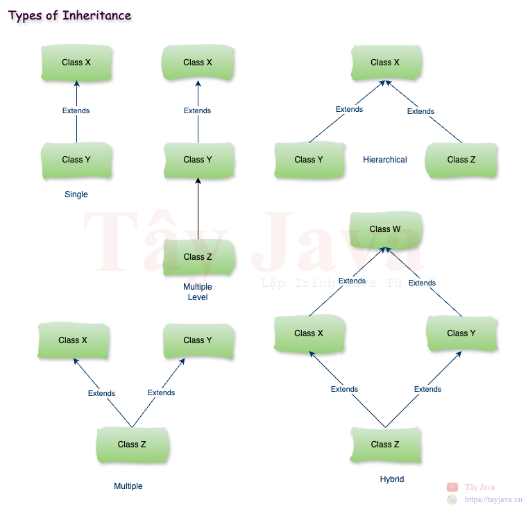

# Lập Trình Hướng Đối Tượng
## 1. Khái niệm về lập trình OOP (Object-Oriented Programming System)
> Lập trình hướng đối tượng là một mô hình lập trình cung cấp nhiều khái niệm như đối tượng, kế thừa, ràng buộc dữ liệu, đa hình, v.v.

> Đối tượng có nghĩa là một thực thể trong thế giới thực như con người, đồ vật hay sự kiện. Lập trình hướng đối tượng là một phương pháp luận hoặc mô hình để thiết kế phần mềm bằng cách sử dụng các lớp và đối tượng. Nó đơn giản hóa việc phát triển và bảo trì phần mềm bằng cách cung cấp một số khái niệm:
* Object (Đối tượng)
* Class (Lớp)
* Inheritance (Kế thửa)
* Polymorphism (Đa hình)
* Abstraction (Trừu tượng)
* Encapsulation (Đóng gói)

### 1.1 Object (Đối tượng)



> Một thực thể có trạng thái và hành vi được gọi là một đối tượng, ví dụ như bàn, ghế, sách, vở, tôm, cua, cá, v.v. Nó có thể là vật lý hoặc logic (hữu hình và vô hình). Ví dụ về một đối tượng vô hình là hệ thống ngân hàng.

> Một đối tượng có ba đặc điểm:
>* State(Trạng thái): biểu diễn dữ liệu (giá trị) của một đối tượng.
>* Behavior(Hành vi): biểu diễn hành vi (chức năng) của một đối tượng như gửi tiền, rút tiền, v.v.
>* Identity(Nhận dạng): Nhận dạng đối tượng thường được triển khai thông qua một ID duy nhất. Người dùng bên ngoài không nhìn thấy giá trị của ID. Tuy nhiên, JVM sử dụng nó bên trong để nhận dạng duy nhất từng đối tượng.

> Đối tượng có thể được định nghĩa là một thể hiện của một lớp. Đối tượng chứa một địa chỉ và chiếm một số không gian trong bộ nhớ. Các đối tượng có thể giao tiếp mà không cần biết chi tiết về dữ liệu hoặc mã của nhau. Điều duy nhất cần thiết là loại tin nhắn được chấp nhận và loại phản hồi mà các đối tượng trả về.

### 1.2 Class (Lớp)


> Một lớp là một nhóm các đối tượng có các thuộc tính chung. Nó là một mẫu hoặc bản thiết kế mà từ đó các đối tượng được tạo ra. Nó là một thực thể logic. Nó không thể là thực thể vật lý.

> Một lớp trong Java có thể chứa:
> * Fields (Các trường)
> * Methods (Phương thức)
> * Constructors (Khởi tạo)
> * Blocks (Khối)
> * Nested class and interface (Lớp lồng nhau và giao diện)
```java
package src;

import java.util.Date;

// SampleClass là tên class (Lớp)
public class SampleClass { // Ký tự { bắt đầu Block của lớp SampleClass

  // Các fields này chính là instance variables
  private Integer id; // đây là fields
  private String firstName; // đây là fields
  private String lastName; // đây là fields
  private Date dateOfBirth; // đây là fields
  private Address address; // đây là fields
  public String message; // đây là fields

  // đây là constructor
  public SampleClass() {
  }

  // đây là constructor có tham số truyền vào
  public SampleClass(Integer id, String firstName, String lastName, Date dateOfBirth) {
    this.id = id;
    this.firstName = firstName;
    this.lastName = lastName;
    this.dateOfBirth = dateOfBirth;
  }

  // đây là method để thể hiện các hành vi (Behavior)
  public Integer getId() { // { bắt đầu Block của method getId()
    return id;
  } // } kết thúc Block của method getId()

  // đây là method để thể hiện các hành vi (Behavior)
  public void setId(Integer id) {
    this.id = id;
  }

  // đây là method để thể hiện các hành vi (Behavior)
  public String getFirstName() {
    return firstName;
  }

  // đây là method để thể hiện các hành vi (Behavior)
  public void setFirstName(String firstName) {
    this.firstName = firstName;
  }

  // đây là method để thể hiện các hành vi (Behavior)
  public String getLastName() {
    return lastName;
  }

  // đây là method để thể hiện các hành vi (Behavior)
  public void setLastName(String lastName) {
    this.lastName = lastName;
  }

  // đây là method để thể hiện các hành vi (Behavior)
  public Date getDateOfBirth() {
    return dateOfBirth;
  }

  // đây là method để thể hiện các hành vi (Behavior)
  public void setDateOfBirth(Date dateOfBirth) {
    this.dateOfBirth = dateOfBirth;
  }

  // đây là method để thể hiện các hành vi (Behavior)
  public String getFullName() {
    return this.firstName + " " + lastName;
  }

  // đây là method để thể hiện các hành vi (Behavior)
  public Address getAddress() {
    return address;
  }

  // đây là method để thể hiện các hành vi (Behavior)
  public void setAddress(Address address) {
    this.address = address;
  }

  // Nested class (Lớp lồng nhau)
  class Address {
    private String street;
    private String district;
    private String city;
    private String country;
  }

  @Override
  public String toString() {
    return "SampleClass{" +
            "id='" + id + '\'' +
            ", firstName='" + firstName + '\'' +
            ", lastName='" + lastName + '\'' +
            '}';
  }
} // Ký tự } kết thúc Block của lớp SampleClass
```

* Instance Variable trong Java:
    > Một biến được tạo bên trong lớp nhưng bên ngoài phương thức được gọi là `Instance Variable`. `Instance Variable` không nhận được bộ nhớ tại thời điểm biên dịch. Nó nhận được bộ nhớ tại thời điểm chạy khi một đối tượng hoặc `Instance` được tạo ra. Đó là lý do tại sao nó được gọi là `Instance Variable`.

* Method trong Java:
    > Trong Java, phương thức giống như hàm được sử dụng để biểu diễn hành vi của một đối tượng (behavior). Với phương thức chúng ta có thể tái sử dụng code hoặc tuỳ chỉnh dễ dàng.

- Từ khoá `new` trong Java
    > Từ khóa `new` được sử dụng để phân bổ bộ nhớ khi chạy. Tất cả các đối tượng đều có bộ nhớ trong vùng bộ nhớ Heap.
    ```java
      public class Main {
        
          public static void main(String[] args) {
            
              // Tạo đối tượng SampleClass với từ khóa new
              SampleClass sampleClass = new SampleClass();
          }
      }
    ```

- Object vs Class
> Một `class` là một mẫu hoặc bản thiết kế để mô tả các thực thể hữu hình hoặc vô hình trong thế giới thật còn `Object` là bản sao hữu hình của `class` được tạo ra tại thời điểm `Runtime` của ứng dụng.
> Như vậy có thể nói `Object` là một `instance` của `Class`

- Có 3 cách để khởi tạo đối tượng
  - Khởi tạo đối tượng thông qua reference variable (biến tham chiếu)
      ```java
    package src;
    
    public class Main {
    
        public static void main(String[] args) {
    
            // Tạo đối tượng SampleClass với từ khóa new
            SampleClass sampleClass = new SampleClass();
    
            // Khởi tạo đối tượng thông qua biến tham chiếu (reference variable)
            sampleClass.message = "Xin chào";
            System.out.println(sampleClass.message);
        }
    }
      ```

  - Khởi tạo đối tượng thông qua biến method (phương thức)
      ```java
    package src;
    
    public class Main {
    
        public static void main(String[] args) {
            // Tạo đối tượng
            SampleClass other = new SampleClass();
    
            // Khởi tạo đối tượng qua method
            other.setId(1);
            other.setFirstName("Tây");
            other.setLastName("Java");
            System.out.println(other);
        }
    }
      ```

  - Khởi tạo đối tượng thông qua constructors
      ```java
    package src;

    import java.util.Date;
    
    public class Main {
    
        public static void main(String[] args) {
    
            // Khởi tạo đối tượng thông qua constructors
            SampleClass someone = new SampleClass(2, "John", "Doe", new Date());
            System.out.println(someone);
        }
    }
      ```

### 1.3 Inheritance (Kế thừa)

> Trong thế giới sinh vật thì các thế hệ con cái kế thừa các đặc điểm tính chất của cha mẹ là điều hết sức hiển nhiên hay việc con người có thể xây dựng nên các bộ khung hoặc biểu mẫu để có thể tái sử dụng nhiều lần nhờ đó mà có thể tiết kiệm được thời gian và tiền bạc trong sản xuất. Trong lập trình hướng đối tượng thì việc kế thừa được định nghĩa và thể hiện như là các `interface` và `class abstract`

#### 1.3.1 Interface

> Interface là bản thiết kế của một lớp. Nó có các hằng số tĩnh và phương thức trừu tượng.

- Syntax:
  ```java
  interface <interface_name>{  
        
    // declare constant fields  
    // declare methods that abstract   
    // by default.
    // static method
  } 
  ```

- Vidu:
  ```java
  package src;
  
  import java.time.LocalDate;
  
  public interface SampleInterface {
  
      // constant fields
      String name = "Tây Java";
  
      // abstract methods
      void method1();
  
      int method2();
  
      String methodN();
  
      // default method
      default void sayHello() {
          System.out.println("Đây là sample interface");
      }
  
      // static method
      static String getCurrentTime(){
          return String.valueOf(LocalDate.now());
      }
  
  }

  ```
  
- Tại sao sử dụng Interface
> Có ba lý do chính để sử dụng Interface như sau.
>* Interface được sử dụng để đạt được sự trừu tượng.
>* Theo Interface, chúng ta có thể hỗ trợ khả năng đa kế thừa.
>* Có thể được sử dụng để đạt được sự kết hợp lỏng lẻo.

- Mối quan hệ giữa các`class` và các `interface`
> Java đưa tính kế thừa vào trong lập trình hướng đối tượng thông qua 2 từ khoá là `extends` và `implement` để thể hiện việc kế thừa giữa các `class` và `interface`

  

  - Một `class` có thể `extends` từ một `class` khác
    - Cú pháp:
      ```java
        class <Subclass-name> extends <Superclass-name> 
      ```
    - Ví dụ: 
      ```java
      package src.model;
  
      import java.util.Date;
    
      // BaseEntity = Superclass-name
      public class BaseEntity {
    
        private Long id;
        private Date createdDate;
        private Date updatedDate;
    
        public Long getId() {
          return id;
        }
    
        public void setId(Long id) {
          this.id = id;
        }
    
        public Date getCreatedDate() {
          return createdDate;
        }
    
        public void setCreatedDate(Date createdDate) {
          this.createdDate = createdDate;
        }
    
        public Date getUpdatedDate() {
          return updatedDate;
        }
    
        public void setUpdatedDate(Date updatedDate) {
          this.updatedDate = updatedDate;
        }
      }
      ```
  
      ```java
      package src.model;
  
      // User = Subclass-name
      // User kế thừa các tính chất, thuộc tính từ BaseEntity
      public class User extends BaseEntity {
    
        private String username;
        private String password;
    
        public String getUsername() {
          return username;
        }
    
        public void setUsername(String username) {
          this.username = username;
        }
    
        public String getPassword() {
          return password;
        }
    
        public void setPassword(String password) {
          this.password = password;
        }
      }
      ```
      ```java
      package src.model;
      
      // Customer = Superclass-name
      // Customer kế thừa các tính chất, thuộc tính từ BaseEntity
      public class Customer extends BaseEntity {
      
          private String fullName;
          private String phone;
          private String email;
      
          public String getFullName() {
              return fullName;
          }
      
          public void setFullName(String fullName) {
              this.fullName = fullName;
          }
      
          public String getPhone() {
              return phone;
          }
      
          public void setPhone(String phone) {
              this.phone = phone;
          }
      
          public String getEmail() {
              return email;
          }
      
          public void setEmail(String email) {
              this.email = email;
          }
      }

      ```

  - Một `interface` có thể `extends` từ một `interface` khác

    ```java
    package src.service;
  
    // Super interface
    public interface BaseService {
    
        default void printMessage() {
            System.out.println("Default message from BaseService");
        }
    }
    ```
  
    ```java
    package src.service;
    
    import src.model.User;
    
    public interface UserService extends BaseService {
    
        int addUser(User user);
    
        void updateUser(User userId);
    
        void deleteUser(long userId);
    }
    ```

  - Một `class` có thể `implements` từ một `interface` khác
    ```java
      package src.service;
      
      import src.model.User;
      
      public interface UserService {
      
          int addUser(User user);
          void updateUser(User userId);
          void deleteUser(long userId);
      }
    ```
  
    ```java
    package src.service.impl;
    
    import src.model.User;
    import src.service.UserService;
    
    // class UserServiceImpl implements (thực thi) interface UserService
    public class UserServiceImpl implements UserService {
      @Override
      public int addUser(User user) {
        System.out.println("-----[ addUser ]-----");
        return 0;
      }
    
      @Override
      public void updateUser(User userId) {
        System.out.println("-----[ updateUser ]-----");
      }
    
      @Override
      public void deleteUser(long userId) {
        System.out.println("-----[ deleteUser ]-----");
      }
    }
    ```

- Đa kế thừa trong Java
  
  

- Một `interface` có thể `extends` từ nhiều `interface` khác

  - Cú pháp:
    ```java
    class <InterfaceName> extends <InterfaceName>, <InterfaceName>
    ```
  - Ví dụ:
    ```java
    public interface UserService extends BaseService, LogService {
      ...
    }
    ```

- Một `class` có thể `implements` từ nhiều `interface`
    
  - Cú pháp:
    ```java
    class <ClassName> implements <InterfaceName>, <InterfaceName>
    ```
  - Ví dụ:
    ```java
    public class UserServiceImpl implements UserService, CommonService {
      ...
    }
    ```

- Các kiểu kế thừa trong Java

  


#### 1.3.1 Abstract


### 1.4 Polymorphism (Đa hình)


### 1.5 Abstraction (Trừu tượng)


### 1.5 Encapsulation (Đóng gói)


---
## Câu hỏi phỏng vấn
- __Có những cách nào để tạo một đối tượng trong Java ?__
> Trả lời:
> * Tạo bằng từ khoá `new`
> * Tạo bằng phương thức `newInstance()`
> * Tạo bằng phương thức `clone()`
> * Tạo bằng deserialization
> * Tạo bằng phương thức Factory

Tham khảo: [How to Create Object in Java?](https://www.scaler.com/topics/object-creation-in-java/)
