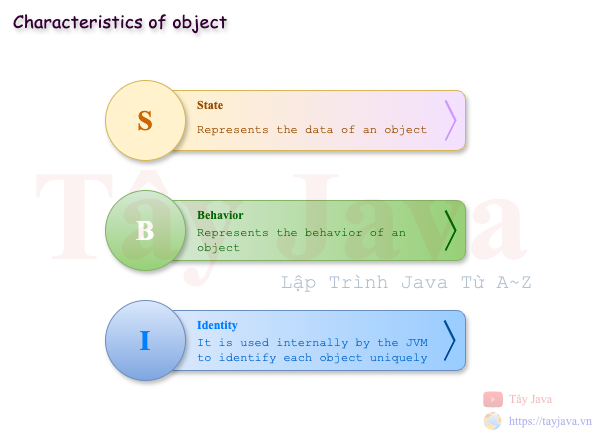
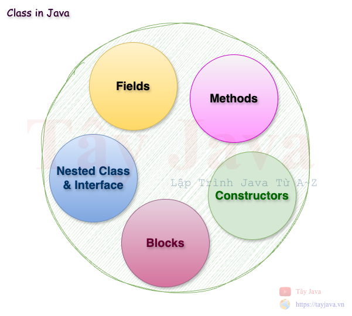
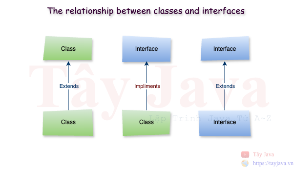
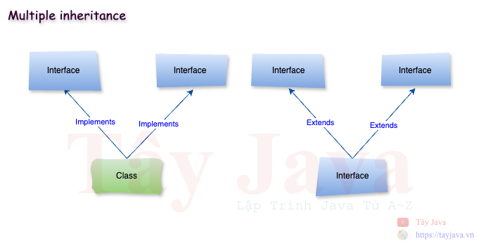
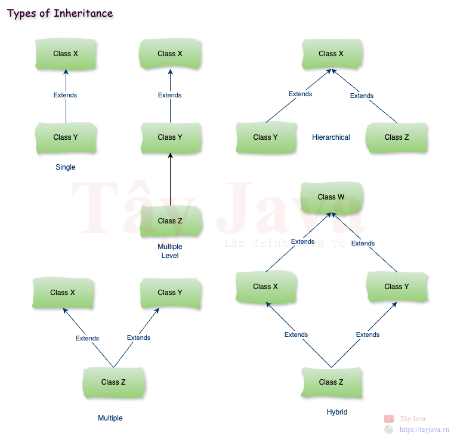
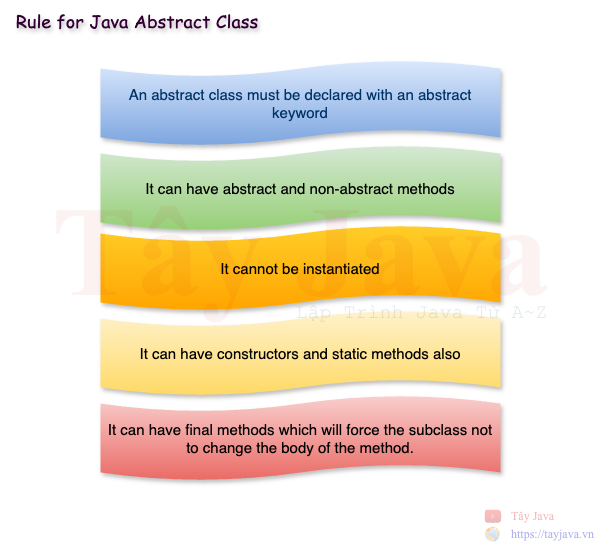
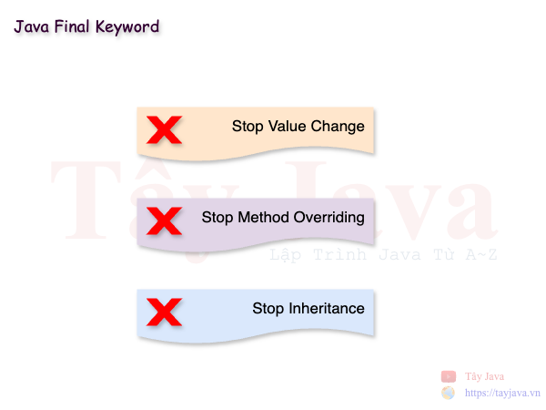

# Lập Trình Hướng Đối Tượng
## 1. Khái niệm về lập trình hướng đối tượng 

Lập trình hướng đối tượng (viết tắt là Object-Oriented Programming System) là một mô hình lập trình cung cấp nhiều khái niệm như đối tượng, kế thừa, ràng buộc dữ liệu, đa hình, v.v.

Đối tượng có nghĩa là một thực thể trong thế giới thực như con người, đồ vật hay sự kiện. Lập trình hướng đối tượng là một phương pháp luận hoặc mô hình để thiết kế phần mềm bằng cách sử dụng các lớp và đối tượng. Nó đơn giản hóa việc phát triển và bảo trì phần mềm bằng cách cung cấp một số khái niệm:
* Object (Đối tượng)
* Class (Lớp)
* Inheritance (Kế thừa)
* Polymorphism (Đa hình)
* Abstraction (Trừu tượng)
* Encapsulation (Đóng gói)

### 2. Object (Đối tượng)



Một thực thể có trạng thái và hành vi được gọi là một đối tượng, ví dụ như bàn, ghế, sách, vở, tôm, cua, cá, v.v. Nó có thể là vật lý hoặc logic (hữu hình và vô hình). Ví dụ về một đối tượng vô hình là hệ thống ngân hàng.

- Một đối tượng có ba đặc điểm:
  * State(Trạng thái): biểu diễn dữ liệu (giá trị) của một đối tượng.
  * Behavior(Hành vi): biểu diễn hành vi (chức năng) của một đối tượng như gửi tiền, rút tiền, v.v.
  * Identity(Nhận dạng): Nhận dạng đối tượng thường được triển khai thông qua một ID duy nhất. Người dùng bên ngoài không nhìn thấy giá trị của ID. Tuy nhiên, JVM sử dụng nó bên trong để nhận dạng duy nhất từng đối tượng.

Đối tượng có thể được định nghĩa là một thể hiện của một lớp. Đối tượng chứa một địa chỉ và chiếm một số không gian trong bộ nhớ. Các đối tượng có thể giao tiếp mà không cần biết chi tiết về dữ liệu hoặc mã của nhau. Điều duy nhất cần thiết là loại tin nhắn được chấp nhận và loại phản hồi mà các đối tượng trả về.

### 3. Class (Lớp)

#### 3.1 Khái niệm
Một class (lớp) là một nhóm các đối tượng có các thuộc tính chung. Nó là một mẫu hoặc bản thiết kế mà từ đó các đối tượng được tạo ra. Nó là một thực thể logic. Nó không thể là thực thể vật lý.



* Một lớp trong Java có thể chứa:
    * Fields (Các trường)
    * Methods (Phương thức)
    * Constructors (Khởi tạo)
    * Blocks (Khối)
    * Nested class and interface (Lớp lồng nhau và giao diện)


#### 3.2 Cú pháp
```java
<public|protected|private> class <class-name> { // { = begin block
    // Fields (Các trường)
   // Methods (Phương thức)
    // Constructors (Khởi tạo)
    
} // } = end block 
```

#### 3.3 Ví dụ:
  ```java
  public class SampleClass { // Ký tự { bắt đầu Block của lớp SampleClass
  
    // Các fields này chính là instance variables
    private Integer id; // đây là fields
    private String firstName; // đây là fields
    private String lastName; // đây là fields
    private Date dateOfBirth; // đây là fields
    private Address address; // đây là fields
    public String message; // đây là fields
  
    // đây là constructor
    public SampleClass() {
    }
  
    // đây là constructor có tham số truyền vào
    public SampleClass(Integer id, String firstName, String lastName, Date dateOfBirth) {
      this.id = id;
      this.firstName = firstName;
      this.lastName = lastName;
      this.dateOfBirth = dateOfBirth;
    }
  
    // đây là method để thể hiện các hành vi (Behavior)
    public Integer getId() { // { bắt đầu Block của method getId()
      return id;
    } // } kết thúc Block của method getId()
  
    // đây là method để thể hiện các hành vi (Behavior)
    public void setId(Integer id) {
      this.id = id;
    }
  
    // đây là method để thể hiện các hành vi (Behavior)
    public String getFirstName() {
      return firstName;
    }
  
    // đây là method để thể hiện các hành vi (Behavior)
    public void setFirstName(String firstName) {
      this.firstName = firstName;
    }
  
    // đây là method để thể hiện các hành vi (Behavior)
    public String getLastName() {
      return lastName;
    }
  
    // đây là method để thể hiện các hành vi (Behavior)
    public void setLastName(String lastName) {
      this.lastName = lastName;
    }
  
    // đây là method để thể hiện các hành vi (Behavior)
    public Date getDateOfBirth() {
      return dateOfBirth;
    }
  
    // đây là method để thể hiện các hành vi (Behavior)
    public void setDateOfBirth(Date dateOfBirth) {
      this.dateOfBirth = dateOfBirth;
    }
  
    // đây là method để thể hiện các hành vi (Behavior)
    public String getFullName() {
      return this.firstName + " " + lastName;
    }
  
    // đây là method để thể hiện các hành vi (Behavior)
    public Address getAddress() {
      return address;
    }
  
    // đây là method để thể hiện các hành vi (Behavior)
    public void setAddress(Address address) {
      this.address = address;
    }
  
    // Nested class (Lớp lồng nhau)
    class Address {
      private String street;
      private String district;
      private String city;
      private String country;
    }
  
    @Override
    public String toString() {
      return "SampleClass{" +
              "id='" + id + '\'' +
              ", firstName='" + firstName + '\'' +
              ", lastName='" + lastName + '\'' +
              '}';
    }
  } // Ký tự } kết thúc Block của lớp SampleClass
  ```

  * Instance Variable trong Java:
  
    Một biến được tạo bên trong lớp nhưng bên ngoài phương thức được gọi là `Instance Variable`. `Instance Variable` không nhận được bộ nhớ tại thời điểm biên dịch. Nó nhận được bộ nhớ tại thời điểm chạy khi một đối tượng hoặc `Instance` được tạo ra. Đó là lý do tại sao nó được gọi là `Instance Variable`.

  * Method trong Java:
  
    Trong Java, phương thức giống như hàm được sử dụng để biểu diễn hành vi của một đối tượng (behavior). Với phương thức chúng ta có thể tái sử dụng code hoặc tuỳ chỉnh dễ dàng.

  * Từ khoá `new` trong Java
  
    Từ khóa `new` được sử dụng để phân bổ bộ nhớ khi chạy. Tất cả các đối tượng đều có bộ nhớ trong vùng bộ nhớ Heap.
      
    ```java
    public static void main(String[] args) {
        
      // Tạo đối tượng SampleClass với từ khóa new
      SampleClass sampleClass = new SampleClass();
    }
    ```

#### 4. Object vs Class

Một `class` là một mẫu hoặc bản thiết kế để mô tả các thực thể hữu hình hoặc vô hình trong thế giới thật còn `Object` là bản sao hữu hình của `class` được tạo ra tại thời điểm `Runtime` của ứng dụng. Như vậy có thể nói `Object` là một `instance` của `Class`

Có 3 cách để khởi tạo đối tượng

* Khởi tạo đối tượng thông qua reference variable (biến tham chiếu)
  ```java
  public static void main(String[] args) {
    
    // Tạo đối tượng SampleClass với từ khóa new
    SampleClass sampleClass = new SampleClass();

    // Khởi tạo đối tượng thông qua biến tham chiếu (reference variable)
    sampleClass.message = "Xin chào";
    System.out.println(sampleClass.message);
  }
  ```

* Khởi tạo đối tượng thông qua biến method (phương thức)
  ```java
  public static void main(String[] args) {
    // Tạo đối tượng
    SampleClass other = new SampleClass();

    // Khởi tạo đối tượng qua method
    other.setId(1);
    other.setFirstName("Tây");
    other.setLastName("Java");
    System.out.println(other);
  }
  ```

* Khởi tạo đối tượng thông qua constructors
  ```java
  public static void main(String[] args) {
    
    // Khởi tạo đối tượng thông qua constructors
    SampleClass someone = new SampleClass(2, "John", "Doe", new Date());
    System.out.println(someone);
  }
  ```

### 5. Inheritance (Kế thừa)

Trong thế giới sinh vật thì các thế hệ con cái kế thừa các đặc điểm tính chất của cha mẹ là điều hết sức hiển nhiên hay việc con người có thể xây dựng nên các bộ khung hoặc biểu mẫu để có thể tái sử dụng nhiều lần nhờ đó mà có thể tiết kiệm được thời gian và tiền bạc trong sản xuất. Trong lập trình hướng đối tượng thì việc kế thừa được định nghĩa và thể hiện như là các `interface` và `class abstract`

#### 5.1 Interface

Interface là bản thiết kế của một lớp. Nó có các hằng số tĩnh và phương thức trừu tượng.

* Cú pháp:
  ```java
  interface <interface_name>{  
        
    // declare constant fields  
    // declare methods that abstract   
    // by default.
    // static method
  } 
  ```

* Ví dụ:
  ```java
  public interface SampleInterface {
  
      // constant fields
      String name = "Tây Java";
  
      // abstract methods
      void method1();
  
      int method2();
  
      String methodN();
  
      // default method
      default void sayHello() {
          System.out.println("Đây là sample interface");
      }
  
      // static method
      static String getCurrentTime(){
          return String.valueOf(LocalDate.now());
      }
  
  }
  ```

#### 5.2 Tại sao sử dụng Interface ?

Có ba lý do chính để sử dụng Interface như sau.
* Interface được sử dụng để đạt được sự trừu tượng.
* Theo Interface, chúng ta có thể hỗ trợ khả năng đa kế thừa.
* Có thể được sử dụng để đạt được sự kết hợp lỏng lẻo.


#### 5.3 Mối quan hệ giữa các`class` và các `interface`

Java đưa tính kế thừa vào trong lập trình hướng đối tượng thông qua 2 từ khoá là `extends` và `implement` để thể hiện việc kế thừa giữa các `class` và `interface`



Như hình thể hiện phía trên, một `class extends` từ một `class` khác, một `interface extends` từ một `interface` khác, Nhưng một `class` thì `implements`(triển khai/thực hiện) một `interface` khác

#### 5.4 Đa kế thừa trong Java
  
  

- Một `interface` có thể `extends` từ nhiều `interface` khác

  - Cú pháp:
    ```java
    class <InterfaceName> extends <InterfaceName>, <InterfaceName>
    ```
  - Ví dụ:
    ```java
    // Super interface
    public interface BaseService {
    
        default void printMessage() {
            System.out.println("Default message from BaseService");
        }
    }
    
    // Super interface
    public interface LogService {
    
        void saveLog();
    
        void printLog();
    }
    
    // Sub interface
    public interface UserService extends BaseService, LogService {
    
        int addUser(User user);
    
        void updateUser(User userId);
    
        void deleteUser(long userId);
    }
    ```

- Một `class` có thể `implements` từ nhiều `interface`
    
  - Cú pháp:
    ```java
    class <ClassName> implements <InterfaceName>, <InterfaceName>
    ```
      
  - Ví dụ:
    ```java
    // class UserServiceImpl implements (thực thi) interface UserService và CommonService
    public class UserServiceImpl implements UserService, CommonService {
    @Override
    public int addUser(User user) {
    System.out.println("-----[ addUser ]-----");
    return 0;
    }
    
        @Override
        public void updateUser(User userId) {
            System.out.println("-----[ updateUser ]-----");
        }
    
        @Override
        public void deleteUser(long userId) {
            System.out.println("-----[ deleteUser ]-----");
        }
    
        @Override
        public void saveLog() {
            System.out.println("-----[ saveLog ]-----");
        }
    
        @Override
        public void printLog() {
            System.out.println("-----[ printLog ]-----");
        }
    
        @Override
        public void connectDB() {
            System.out.println("-----[ connectDB ]-----");
        }
    }
    ```

#### 5.5 Các kiểu kế thừa trong Java

  

* Single
* Multiple Level
* Hierarchical
* Multiple
* Hybrid

### 6. Abstraction (Trừu tượng hoá)
#### 6.1 Abstraction trong Java
Abstraction là quá trình ẩn đi các chi tiết thực hiện chỉ hiển thị chức năng với những thông tin cần thiết cho người dùng. Người dùng chỉ có thể nhận được kết qủa mà không thế biết được quá trình, các bước tạo ra kết quả đó.

Các cách để đạt được Abstraction
- class abstract (0 đến 100%)
- interface (100%)

#### 6.2 Abstract class trong Java
Một `class` được khai báo bằng từ khóa `abstract` được gọi là lớp trừu tượng trong Java. Nó có thể có các phương thức `abstract` và `non-abstract` (phương thức có phần thân). Nó cần được `extends` và các method của nó cần `implements` để thực hiện các logic. Abstract class thì không thể khởi tạo.

Những điểm cần nhớ
* Một lớp trừu tượng phải được khai báo bằng từ khóa `abstract`.
* Nó có thể có các phương thức trừu tượng(abstract method) và không trừu tượng((none-abstract method).
* Nó không thể được khởi tạo.
* Nó cũng có thể có các `constructor` và phương thức tĩnh(static method).
* Nó có thể có các `final method`



- Ví dự:
```java
// class abstract <Class-name>
public abstract class SampleAbstractClass {

  // abstract method
  public abstract void sayHello(); // abstract method has not body

  // no abstract method has body
  public int calculate(int a, int b) {
    return a + b;
  }

  // static method
  public static void sayGoodBye() {
    System.out.println("Bye!");
  }

  // constructor
  protected SampleAbstractClass() {
  }

  // final method
  public final void noChangeBody(){
    System.out.println("Lớp con không được thay đổi nội dung của phương thức này vì nó là final method");
  }
}

// class extends từ abstract class
public class SampleExtendClass extends SampleAbstractClass {
  @Override // Ghi đè phương thức abstract method
  public void sayHello() {
    System.out.println("Hello, Tay Java");
  }

  @Override // Ghi đè phương thức non-abstract method
  public int calculate(int a, int b) {
    return a * b;
  }
}
```

#### 6.3 Sự khác nhau giữa abstract class và interface
Cả `interface` và `abstract class` đều được sử dụng để thực hiện trừu tượng hoá trong Java, chúng ta có thể định nghĩa các phương thức trừu tượng (abstract method) nhưng không thể khởi tạo `interface` và `abstract class`. 

`Interface` và `abstract class` có sự khác biệt như hình phía dưới

| #  | Abstract class                                                                                             | Interface                                                                               |
|----|------------------------------------------------------------------------------------------------------------|-----------------------------------------------------------------------------------------|
| 1  | Abstract class có thể có abstract and non-abstract methods.                                                | Interface chỉ có abstract method. Từ Java 8 nó có thêm default and static methods       |
| 2  | Abstract class không hỗ trợ đa kế thừa.                                                                    | Interface hỗ trợ đa kế thừa                                                             |
| 3  | Abstract class có các biến final, non-final, static and non-static variables.                              | Interface chỉ có biến static and final variables.                                       |
| 4  | Abstract class có thể cung cấp các thực thi của `interface`                                                | Interface không thể cung cấp các thực thi `abstract class`.                             |
| 5  | Từ khoá `abstract` được dùng để định nghĩa `abstract class`.                                               | Từ khoá `interface` được dùng để định nghĩa `interface`                                 |
| 6  | Môt `abstract class` có thể `extends` từ Java class khác và `implements` nhiều `interface` khác.           | Một `interface` chỉ có thể `extends` từ các `interface` khác                            |
| 7  | Môt `abstract class` có thể được mở rộng và thực thi với từ khoá `extends`                                 | Một `interface` chỉ có thể được thực thi và triển khai khi sử dụng từ khoá `implements` |
| 8  | Môt `abstract class` cho phép sử dụng tất cảc các từ khoá truy xuất như `private`, `protected` và `public` | Một `interface` chỉ cho phép sử dụng từ khoá truy xuất là `public`             |


### 7. Polymorphism (Đa hình)

Đa hình trong Java là một khái niệm mà chúng ta có thể thực hiện một hành động duy nhất theo nhiều cách khác nhau. Đa hình bắt nguồn từ 2 từ tiếng Hy Lạp: poly và morphs. Từ "poly" có nghĩa là nhiều và "morphs" có nghĩa là hình thức. Vì vậy, đa hình có nghĩa là nhiều hình thức.

Có hai loại đa hình trong Java là đa hình trong thời gian biên dịch (Compile-time polymorphism) và đa hình thời gian chạy (Runtime polymorphism). Chúng ta có thể thực hiện đa hình trong Java bằng cách nạp phương thức nạp chồng (Overloading Method) và phương thức ghi đè (Overriding Method).

#### 7.1 Method Overloading (Phương thức nạp chồng)

Nếu một `class` có nhiều `method` có cùng tên nhưng khác tham số, thì được gọi là Method Overloading

Có 2 cách để tạo ra Method Overloading
- Thay đổi số lượng arguments
- Thay đổi kiểu dữ liệu

Ví dụ:
```java
public class SampleOverLoading {

    // Thay đổi số lượng arguments
    public int add(int a, int b) {
        return a + b;
    }

    public int add(int a, int b, int c) {
        return a + b + c;
    }

    // Thay đổi kiểu dữ liệu <data-type>
    public float add(float a, float b) {
        return a + b;
    }

    public float add(float a, float b, float c) {
        return a + b + c;
    }
}
```

#### 7.2 Method overriding (Phương thức ghi đè)

Nếu `Subclass` có cùng method như được khai báo trong `Super class` thì được gọi là `method overriding` trong Java. 

Nói cách khác, nếu một lớp con cung cấp `implements` cụ thể của một method đã được định nghĩa trong `Parent class` thì được gọi là `method overriding`.

* Ví dụ 1:
```java
// Nếu `Subclass` có cùng method như được khai báo trong `Super class` thì được gọi là `method overriding` trong Java. 

// Super class
public abstract class SampleAbstractClass {

    // abstract method
    public abstract void sayHello(); // abstract method has not body

    // no abstract method has body
   public int calculate(int a, int b) {
        return a + b;
    }

    // static method
    public static void sayGoodBye() {
        System.out.println("Bye!");
    }

    // constructor
    protected SampleAbstractClass() {
    }

    // final method
    public final void noChangeBody(){
        System.out.println("Lớp con không được thay đổi nội dung của phương thức này vì nó là final method");
    }
}


// Subclass
public class SampleExtendClass extends SampleAbstractClass {
  @Override // method overriding
  public void sayHello() {
    System.out.println("Hello, Tay Java");
  }

  @Override // method overriding
  public int calculate(int a, int b) {
    return a * b;
  }
}
```

* Ví dụ 2:
```java
// Nói cách khác, nếu một lớp con cung cấp `implements` cụ thể của một method đã được định nghĩa trong `Parent class` thì được gọi là `method overriding`.

// Subclass
public interface SampleInterface {

  // constant fields
  String name = "Tây Java";

  // abstract methods
  void method1();

  int method2();

  String methodN();

  // default method
  default void sayHello() {
    System.out.println("Đây là sample interface");
  }

  // static method
  static String getCurrentTime() {
    return String.valueOf(LocalDate.now());
  }

}

// Parent class
public class SampleMethodOverriding implements SampleInterface {
  @Override
  public void method1() {
    // code here
  }

  @Override
  public int method2() {
    return 0;
  }

  @Override
  public String methodN() {
    return "";
  }

  @Override
  public void sayHello() {
    SampleInterface.super.sayHello(); // super key
  }
}
```

Từ khóa `super` trong Java là một biến tham chiếu được sử dụng để tham chiếu đến đối tượng lớp cha trực tiếp. Khi sử dụng từ khoá `super` ta có thể tham chiếu trực tiếp đến lớp cha và gọi các `method` hoặc `constructor` của Lớp cha.

Tứ khoá `final` được sử dụng trong java để hạn chế user, nó có thể áp dụng cho các ngữ cảnh với variable, method và class.



- Một `variable` được chỉ định với từ khoá `final` điều đó có nghĩa là `variable` này không thể thay đổi giá trị.
- Một `method` được chỉ định với từ khoá `final` điều đó có nghĩa là `method` này không thể overriding.
- Một `class` được chỉ định với từ khoá `final` điều đó có nghĩa là `class` này không thể được `extends`.

Ví dụ:
```java
// class này không thể được extends
final class FinalClass {
  // code here
}


public class FinalMethod {

  // variable này không thể thay đổi giá trị
  final String keyword = "Final keyword";

  // method này không thể overriding
  final void cannotChange() {

  }
}
```

### 8. Encapsulation (Đóng gói)

#### 8.1 Java Package
Một `package` java là một nhóm các loại `class`, `interface` và `sub-package`

`package` có thể được phân loại thành hai dạng laf gói tích hợp(built-in package) và gói do người dùng định nghĩa(user-defined package).

Có nhiều gói tích hợp như java, lang, awt, javax, swing, net, io, util, sql, v.v.

- Ưu điểm của Java Package
  * Java package được sử dụng để phân loại các `class` và `interface` để dễ dàng bảo trì chúng.
  * Java package cung cấp khả năng bảo vệ quyền truy cập tới các thành phần bên trong nó.
  * Java package loại bỏ xung đột đặt tên.


#### 8.2 Access Modifiers (Chỉ định truy xuất)
Java cung cấp 2 loại modifier là `access modifier` và `non-access modifier`.

__Access modifier__ chỉ định khả năng truy xuất trên các `field`, `method`, `constructor` và `class`. Chúng ta có thể thay đổi mức độ truy xuất trên các `field`, `method`, `constructor` và `class` bằng cách áp dụng `access modifier`.

Có 4 Access modifier như sau:
* __Private__: Mức truy xuất chỉ nằm trong lớp. Không thể truy cập từ bên ngoài lớp.
* __Default__: Mức truy xuất chỉ nằm trong `package`. Không thể truy cập từ bên ngoài `package`. Nếu bạn không chỉ định bất kỳ `access modifier` nào thì đó sẽ là mức truy cập mặc định.
* __Protected__: Mức truy xuất được bảo vệ nằm trong `package` và bên ngoài `package` thông qua lớp con. Nếu bạn không tạo lớp con, thì không thể truy cập từ bên ngoài gói.
* __Public__: Mức truy xuất công khai trên toàn bộ package. Có thể truy cập từ bên trong lớp, bên ngoài lớp, bên trong gói và bên ngoài gói.


#### 8.3 Encapsulation

Đóng gói trong Java là một quá trình đóng gói mã và dữ liệu lại với nhau thành một đơn vị duy nhất nhằm mục tiêu che dấu dữ liệu.


---
## Câu hỏi phỏng vấn
#### 1. Có những cách nào để tạo một đối tượng trong Java ?
**Trả lời:**
* Tạo bằng từ khoá `new`
* Tạo bằng phương thức `newInstance()`
* Tạo bằng phương thức `clone()`
* Tạo bằng deserialization
* Tạo bằng phương thức Factory

Tham khảo: [How to Create Object in Java?](https://www.scaler.com/topics/object-creation-in-java/)

#### 2. Overloading và Overriding khác nhau ở như nào ?
#### 3. Private, Protected, Public khác nhau như thế nào ?
#### 4. Từ khoá `final` dùng để làm gì ?
#### 5. Khi nào dùng biến tĩnh `static variable`

