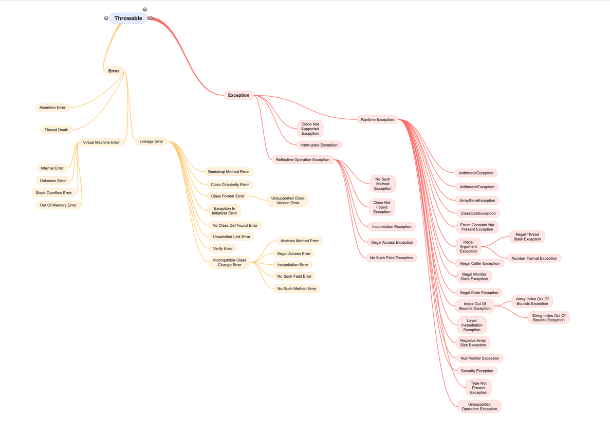

# Exception Handling in Java

Exception Handling trong Java là cơ chế xử lý các lỗi xảy ra trong ứng dụng để đảm bảo ứng dụng hoạt động ổn định và tránh bị gián đoạn đột ngột. Java cung cấp các từ khóa để xử lý ngoại lệ bao gồm: `try`, `catch`, `finally`, `throw`, và `throws`.


### 1. Cấu trúc của lớp Java Exception

Lớp `java.lang.Throwable` là lớp gốc của hệ thống phân cấp `Java Exception` được kế thừa bởi hai lớp con: `Exception` và `Error`.



### 2. Các loại Exception trong Java:

Trong Java, exceptions được chia làm hai loại chính:

- **Checked Exceptions**: Đây là những ngoại lệ mà trình biên dịch bắt buộc phải xử lý (thường là ngoại lệ có thể xảy ra trong quá trình đọc file, kết nối cơ sở dữ liệu,...). Ví dụ: IOException, SQLException.
- **Unchecked Exceptions**: Là những ngoại lệ xảy ra khi có lỗi lập trình và không bị trình biên dịch kiểm tra. Thường là các lỗi logic trong chương trình, ví dụ: ArithmeticException, NullPointerException, ArrayIndexOutOfBoundsException.

### 3. Các từ khóa chính:
- **try**: Được sử dụng để bao bọc đoạn mã có thể phát sinh ngoại lệ.
- **catch**: Dùng để xử lý các ngoại lệ phát sinh trong khối `try`. Khi ngoại lệ xảy ra, Java sẽ tìm khối catch tương ứng để xử lý.
- **finally**: Khối lệnh này luôn được thực thi dù ngoại lệ có xảy ra hay không. Nó thường được dùng để dọn dẹp tài nguyên như đóng tệp hoặc kết nối cơ sở dữ liệu.
- **throw**: Được dùng để ném ra một ngoại lệ một cách rõ ràng trong chương trình.
- **throws**: Khai báo ngoại lệ có thể phát sinh trong phương thức, để phương thức gọi biết rằng ngoại lệ có thể xảy ra và phải được xử lý.

### 4. Cú pháp Exception Handling
- try/catch/finally
```java
try {
    // Mã có thể gây ra ngoại lệ
} catch (ExceptionType1 e1) {
    // Xử lý ngoại lệ loại ExceptionType1
} catch (ExceptionType2 e2) {
    // Xử lý ngoại lệ loại ExceptionType2
} finally {
    // Mã sẽ luôn thực thi
}
```

Ví dụ:
```java
public class App {
    public static void main(String[] args) {
        try {
            int result = 10 / 0;  // Sẽ phát sinh ArithmeticException
        } catch (ArithmeticException e) {
            System.out.println("Không thể chia cho 0");
        } finally {
            System.out.println("Đoạn code ở finally luôn được thực hiện");
        }
    }
}
```

- Sử dụng throw và throws

```java
public class App {
    public static void main(String[] args) {
        // handle exception by try/catch
        try {
            validateAge(16);
        } catch (ArithmeticException e) {
            System.out.println(e.getMessage());
        }
    }

    // throws được sử dụng để khai báo loại ngoại lệ có thể phát sinh
    static void validateAge(int age) throws ArithmeticException {
        if (age < 18) {
            // throw để ném ngoại lệ khi điều kiện không thỏa mãn
            throw new ArithmeticException("Không đủ tuổi cưới vợ");
        } else {
            System.out.println("Bác sỹ bảo cưới thì cưới");
        }
    }
}
```

### 5. Lợi ích của Exception Handling
> Exception Handling giúp chương trình Java có thể xử lý các lỗi tiềm tàng mà không làm gián đoạn hoạt động của ứng dụng và giúp lập trình viên dễ dàng kiểm soát luồng xử lý của chương trình khi các lỗi phát sinh.
- **Bảo vệ chương trình khỏi bị dừng đột ngột**: Khi một ngoại lệ xảy ra, chương trình không bị dừng ngay lập tức mà thay vào đó nó tìm kiếm cách xử lý ngoại lệ.
- **Tách biệt logic bình thường và xử lý lỗi**: Chương trình dễ đọc hơn và có cấu trúc rõ ràng hơn.
- **Giảm thiểu rủi ro của lỗi**: Bằng cách xử lý các trường hợp ngoại lệ có thể xảy ra.

### 6. Lưu ý trong xử lý Exception Handling
- **Không xử lý ngoại lệ chung chung**: Tránh sử dụng catch(Exception e) mà không kiểm tra loại ngoại lệ cụ thể.
- **Đừng bỏ qua khối catch**: Đảm bảo rằng bạn thực sự xử lý hoặc ghi lại thông tin về ngoại lệ thay vì để nó trống.
- **Dùng finally để giải phóng tài nguyên**: Nếu tài nguyên cần được đóng lại (như kết nối cơ sở dữ liệu hoặc file), hãy sử dụng `finally`.
- **Tạo custom exceptions**: Để xử lý những trường hợp đặc biệt, bạn có thể tạo các lớp ngoại lệ riêng của mình bằng cách kế thừa từ `Exception` hoặc `RuntimeException`.

```java
class CustomException extends Exception {
    CustomException(String message) {
        super(message);
    }
}
```

---
## Câu hỏi phỏng vấn
#### 1. Exception là gì? Phân biệt Checked và Unchecked Exception?
- **Exception** là một tình huống bất thường xảy ra trong quá trình thực thi chương trình, làm gián đoạn luồng chương trình.
- **Checked Exception** là những ngoại lệ bắt buộc phải được xử lý tại `compile-time`, như `IOException`, `SQLException`. Trình biên dịch yêu cầu chúng ta phải xử lý chúng bằng cách sử dụng `try-catch` hoặc `throws`.
- **Unchecked Exception** là những ngoại lệ xảy ra trong `runtime`, như `NullPointerException`, `ArrayIndexOutOfBoundsException`. Chúng không bắt buộc phải được xử lý tại `compile-time`.

#### 2. Sự khác nhau giữa throw và throws là gì?
- **throw** được dùng để ném một ngoại lệ cụ thể trong một khối mã. Ví dụ: `throw new ArithmeticException("Lỗi chia cho 0")`.
- **throws** được sử dụng trong khai báo phương thức để chỉ ra rằng phương thức có thể ném một hoặc nhiều ngoại lệ. Ví dụ: `public void doSomething() throws IOException`.

#### 3. Lợi ích của việc sử dụng khối finally là gì?
Khối `finally` luôn được thực thi cho dù có ngoại lệ xảy ra hay không. Nó được sử dụng để dọn dẹp tài nguyên như đóng tệp, ngắt kết nối cơ sở dữ liệu, hoặc giải phóng bộ nhớ.

#### 4. Bạn có thể định nghĩa ngoại lệ tùy chỉnh trong Java không? Nếu có, làm thế nào?
Có thể tạo ngoại lệ tùy chỉnh bằng cách kế thừa từ lớp `Exception` hoặc `RuntimeException`. Ví dụ:

```java
class CustomException extends Exception {
    public CustomException(String message) {
        super(message);
    }
}
```
#### 5. Điều gì xảy ra nếu không xử lý ngoại lệ trong Java?
Nếu không xử lý ngoại lệ, chương trình sẽ bị dừng ngay lập tức khi ngoại lệ xảy ra. Ngoại lệ sẽ được đẩy lên đến phương thức gọi cao hơn (call stack), và nếu không có phương thức nào xử lý nó, chương trình sẽ kết thúc với một thông báo lỗi.

#### 6. Có thể có nhiều khối catch cho một khối try không? Điều đó có ý nghĩa gì?
Có thể có nhiều khối `catch` cho một khối `try`. Mỗi khối catch sẽ xử lý một loại ngoại lệ khác nhau. Điều này cho phép lập trình viên xử lý từng loại ngoại lệ cụ thể theo cách riêng của chúng.
```java
try {
    // Mã có thể gây ngoại lệ
} catch (IOException e) {
    // Xử lý IOException
} catch (ArithmeticException e) {
    // Xử lý ArithmeticException
}
```

#### 7. Điều gì xảy ra nếu cả khối try và catch đều có lệnh return? Khối finally có được thực thi không?
Khối `finally` vẫn được thực thi ngay cả khi khối `try` hoặc `catch` có lệnh `return`. Tuy nhiên, giá trị được trả về từ `finally` (nếu có) sẽ ghi đè giá trị của lệnh `return` trong `try` hoặc `catch`.
```java
public int doSomething() {
    try {
        return 1;
    } catch (Exception e) {
        return 2;
    } finally {
        return 3;  // Giá trị này sẽ được trả về
    }
}
```

#### 8. Có thể bỏ qua khối catch khi sử dụng try không?
Có thể bỏ qua khối catch nhưng phải sử dụng khối `finally`. Điều này hữu ích khi bạn muốn đảm bảo tài nguyên luôn được giải phóng, ngay cả khi ngoại lệ không được xử lý.
```java
try {
    // Mã có thể ném ra ngoại lệ
} finally {
    // Luôn thực thi
}
```

#### 9. Tại sao không nên sử dụng catch (Exception e) một cách chung chung?
Sử dụng `catch` (Exception e) một cách chung chung không phải là một thực hành tốt vì nó có thể che giấu những ngoại lệ cụ thể, làm cho việc gỡ lỗi trở nên khó khăn hơn. Bạn nên bắt từng ngoại lệ cụ thể để có thể xử lý đúng cách.

#### 10. Điều gì sẽ xảy ra nếu ngoại lệ không được xử lý trong khối catch?
Nếu ngoại lệ không được xử lý đúng cách trong khối `catch`, nó sẽ tiếp tục được truyền lên tới phương thức gọi cho đến khi gặp phương thức có khối `try-catch` phù hợp. Nếu không có khối `catch` nào xử lý ngoại lệ, chương trình sẽ kết thúc và in ra `trace log`.
