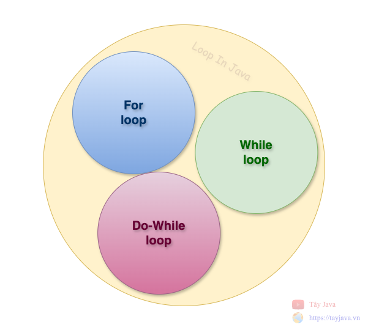
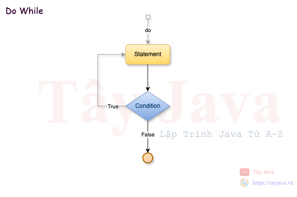
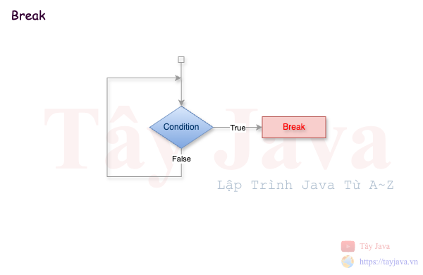

# Các câu lênh điều khiển trong Java
> Trình biên dịch Java thực thi mã từ trên xuống dưới. Các câu lệnh trong mã được thực thi theo thứ tự xuất hiện của chúng. Tuy nhiên, Java cung cấp các câu lệnh có thể được sử dụng để kiểm soát luồng mã Java. Các câu lệnh như vậy được gọi là câu lệnh kiểm soát luồng. Đây là một trong những tính năng cơ bản của Java, cung cấp luồng chương trình mượt mà.

### 1. Câu lệnh điều kiện (Decision Making statements)
#### 1.1 If else

- Cú pháp:
```java
if(condition){
//code to be executed  
}
```
- Ví dụ:
```java
int age = 25;

if (age >= 18) {
    System.out.println("Đã đủ tuổi cưới vợ rồi");
}
```
- __Bối cảnh áp dụng:__ kiểm tra điều kiện để thực hiện 1 hành động nào đó liên quan
Giả sử khi user gứi thông tin đăng ký tới hệ thống thì các thông tin đó cần phải được xác nhận là hợp lệ nếu họ nhập không đúng thì chúng ta sẽ ko cho họ đăng ký và yêu cầu nhập lại


#### 1.2 Switch

- Cú pháp:
```java
switch(expression){
    case value1:
    //code to be executed;    
    break;  //optional  
    case value2:
    //code to be executed;    
    break;  //optional  
    default:
        // code to be executed if all cases are not matched;
} 
```
- Ví dụ:
```java
String expression = "874";
switch(expression){
    case "123":
        System.out.println("Bạn đã nhận được khoản tiền thưởng 100k");
        break;
    case "874":
        System.out.println("Bạn đã nhận được khoản tiền thưởng 200k");
        break;
    case "692":
        System.out.println("Bạn đã nhận được khoản tiền thưởng 500k");
        break;
    default:
        System.out.println("Chúc bạn lần sau may mắn");
}
```
- __Bối cảnh áp dụng:__ Khi có nhiều điều kiện phức tạp


### 2. Câu lệnh lặp (Loop statements)

#### 2.1 for

> Vòng lặp for của Java được sử dụng để lặp lại một phần của chương trình nhiều lần. Nếu số lần lặp cố định, nên sử dụng vòng lặp for.

- Cú pháp:
```java
for(initialization; condition; increment/decrement){
    //statement or code to be executed    
} 
```
- Flowchart


- Ví dụ:
```java
for (int i = 0; i < 10; i++) {
    System.out.println("So: " + i);
}

// Lặp chồng lặp (++)
for (int i = 1; i <= 10; i++) {
    for (int j = 1; j <= i; j++) {
        System.out.print("* ");
    }
    System.out.println();
}

// Lặp chồng lặp (++)
for (int i = 1; i <= 10; i++) {
    for (int j = 10; j >= i; j--) {
        System.out.print("* ");
    }
    System.out.println();
}
```
- __Bối cảnh áp dụng:__ Đọc một danh sách theo tuần tự để tìm ra giá trị tương ứng

#### 2.1 foreach
- Cú pháp:
```java
for(data_type variable : array_name){
    //code to be executed    
} 
```
- Ví dụ:
```java
List<String> list = new ArrayList<>();
list.add("A");
list.add("B");
list.add("C");
list.add("D");
list.add("E");
list.add("F");
list.add("H");

for (String s: list) {
System.out.println(s);
}
```
- __Bối cảnh áp dụng:__ Đọc một danh sách với các kiểu dữ liệu khác nhau theo tuần tự để tìm ra giá trị tương ứng 

#### 2.3 while
> Vòng lặp while của Java được sử dụng để lặp lại một phần của chương trình nhiều lần cho đến khi điều kiện Boolean được chỉ định là đúng. Ngay khi điều kiện Boolean trở thành sai, vòng lặp sẽ tự động dừng lại.
- Cú pháp:
```java
while (condition){    
//code to be executed   
I ncrement / decrement statement  
}
```

- Flowchart


- Ví dụ:
```java
int x = 5;
while (x <= 10) {
    System.out.println(x);
    x++;
}
```
- __Bối cảnh áp dụng:__ dùng để duyệt dang sách theo điều kiện chỉ định trước

#### 2.4 do while
- Cú pháp:
```java
do{    
//code to be executed / loop body  
//update statement   
} while (condition);
```

- Flowchart



- Ví dụ:
```java
int y = 5;
do {
    System.out.println(y);
    y++;
} while (y <= 10);
```
- __Bối cảnh áp dụng:__ dùng để duyệt dang sách theo điều kiện chỉ định sau

### 3. Câu lệnh ngắt quãng (Jump statements)
#### 3.1 break
> Khi gặp câu lệnh break bên trong vòng lặp, vòng lặp sẽ ngay lập tức kết thúc và chương trình sẽ tiếp tục điều khiển ở câu lệnh tiếp theo sau vòng lặp.

> Câu lệnh break của Java được sử dụng để ngắt vòng lặp hoặc câu lệnh chuyển đổi. Nó ngắt luồng hiện tại của chương trình ở điều kiện được chỉ định. Trong trường hợp vòng lặp bên trong, nó chỉ ngắt vòng lặp bên trong.

> Chúng ta có thể sử dụng câu lệnh break của Java trong tất cả các loại vòng lặp như vòng lặp for, vòng lặp while và vòng lặp do-while.


- Cú pháp:
```java
jump-statement;    
break;  
```

- Flowchart



- Ví dụ:
```java
for (int i = 0; i < 10; i++) {
    if (i==5) {
        break; // ngặt vong lặp ở đây
    }
    System.out.println("So: " + i);
}
```
- __Bối cảnh áp dụng:__ Dùng khi ta muốn dừng vòng lặp ngay lập tức
#### 3.2 continue
> Câu lệnh continue được sử dụng trong cấu trúc điều khiển vòng lặp khi bạn cần nhảy đến vòng lặp tiếp theo của vòng lặp ngay lập tức. Nó có thể được sử dụng với vòng lặp for hoặc vòng lặp while.

> Câu lệnh continue của Java được sử dụng để tiếp tục vòng lặp. Nó tiếp tục luồng hiện tại của chương trình và bỏ qua mã còn lại ở điều kiện đã chỉ định. Trong trường hợp vòng lặp bên trong, nó chỉ tiếp tục vòng lặp bên trong.

> Chúng ta có thể sử dụng câu lệnh continue của Java trong tất cả các loại vòng lặp như vòng lặp for, vòng lặp while và vòng lặp do-while.
- Cú pháp:
```java
jump-statement;    
continue; 
```

- Flowchart


- Ví dụ:
```java
for (int i = 0; i < 10; i++) {
    if (i==5) {
        continue; // gặp lệnh continue for sẽ dùng ở đây và chạy vòng tiếp theo
    }
    System.out.println("So: " + i);
}
```
- __Bối cảnh áp dụng:__ Sử dụng khi ta muốn bỏ qua điều kiện nào đó khi duyệt mảng

---
### 4. Chú thích trong java
```java

// chu thich cho dòng

/**
 * Mô tả tên chức năng của method
 * @param args mô tả tham số
 */
```
- Ví dụ:
```java
    /**
 * In ra họ và tên
 *
 * @param name string
 */
private void print(String name) {

    // câu lệnh để in ra
    System.out.println("Name: " + name);
}
```


---
### 5. Bài tập

Tự thực hành theo ví dụ phía trên

